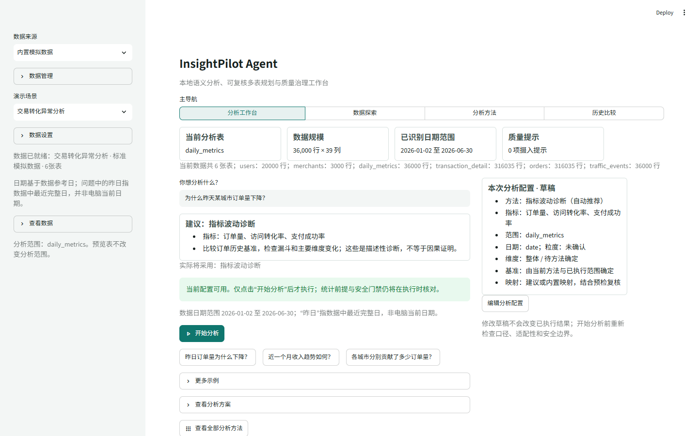
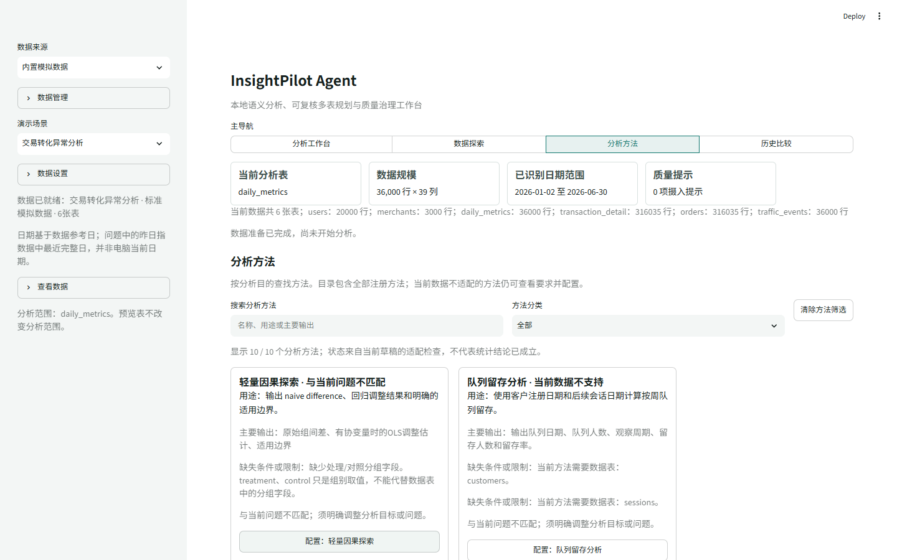
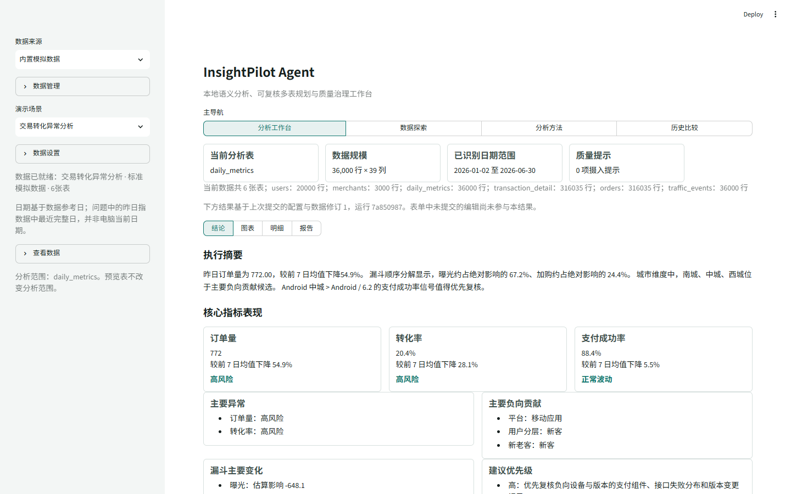
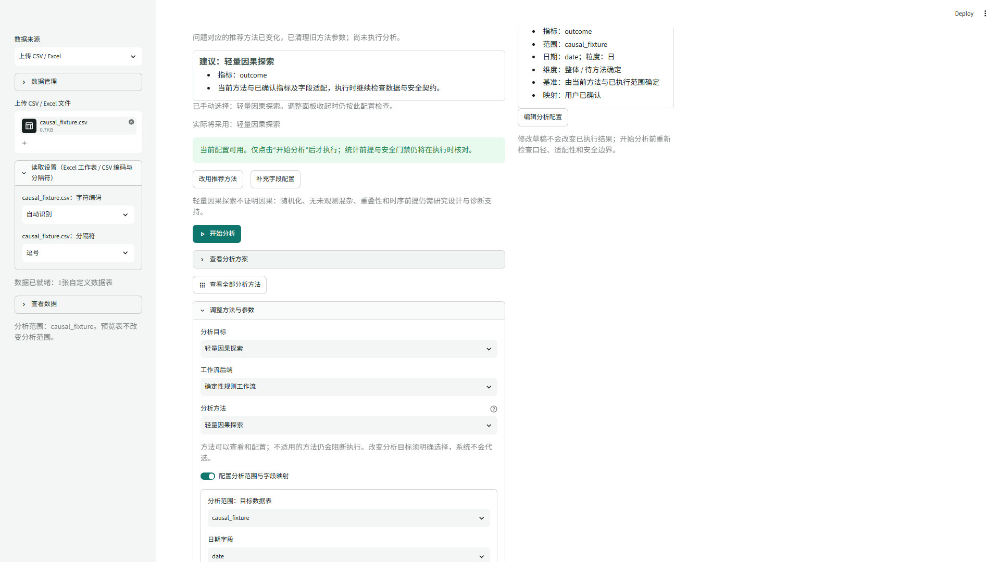
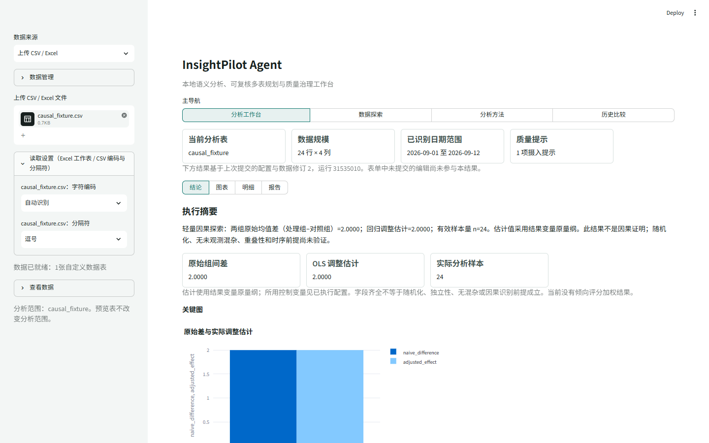
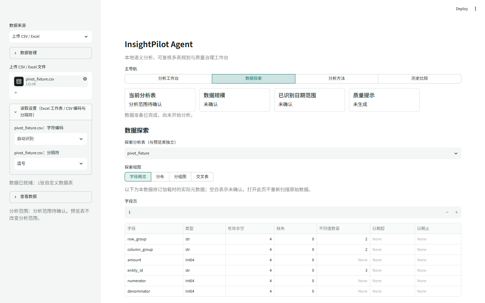
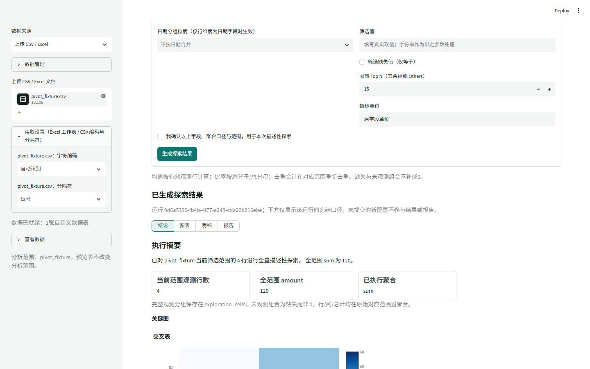
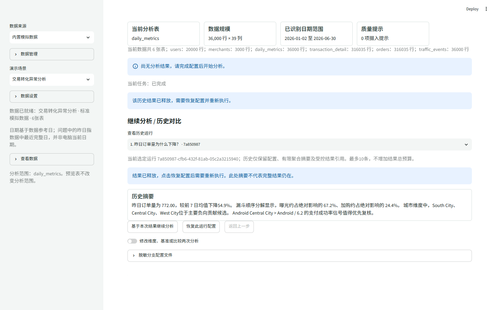
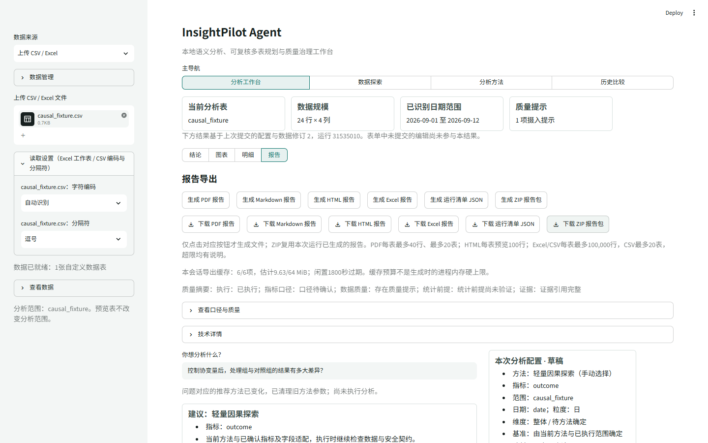

# InsightPilot Agent 0.1.0 中文使用手册

适用版本：0.1.0。操作路径更新日期：2026-10-08。教学数据和截图沿用 2026-09-30 核对的模拟数据画面，局部布局以本文更新后的操作路径为准。

2026-09-30 的离线 HTML、使用手册 PDF 和速查卡 PDF 本轮未重建，尚不包含结果旁返回与恢复流程。当前路径以本 Markdown 与[速查卡](quick_reference.md)为准。维护者可从项目根目录运行 `python docs/tools/build_user_manual.py --output-dir reports/user-manual/<新的构建目录>` 生成新文件并核对排版；旧截图不会因此自动更新。

本手册用于日常分析、查看结果与保存报告。软件默认在本机使用已有规则和统计方法，不需要训练 Agent、在线模型账号或 API key。它只能处理当前支持的问题、字段和方法；方法能运行不代表统计前提或因果关系已经成立。

## 目录

1. [完成第一次分析](#first-analysis)
2. [启动、打开、停止与重开](#start-stop)
3. [四个主导航与结果位置](#navigation)
4. [用自己的数据](#own-data)
5. [选择方法：速查表与十个操作卡](#methods)
6. [交易变化分析与城市下钻](#transaction)
7. [实验组与对照组比较](#experiment)
8. [轻量因果探索：24 行完整示例](#causal)
9. [数据探索与四行透视示例](#exploration)
10. [历史、分支与比较](#history)
11. [导出与日常保存](#exports)
12. [提示、故障与性能](#troubleshooting)
13. [命令与术语参考](#reference)

## 1. 完成第一次分析

目标是用内置交易模拟数据回答“昨日订单量为什么下降？”，再保存一份 PDF。已运行的应用直接打开 [本机工作台](http://127.0.0.1:8511/)；尚未运行时先按[启动说明](#start-stop)操作。

1. 左侧“数据来源”选择“内置模拟数据”，“演示场景”选择“交易转化异常分析”。展开“数据设置”，核对“数据规模”为“标准”、“随机种子”为 42。等待“数据已就绪”及当前分析表、规模、日期范围显示。
2. 进入“分析工作台”，在“你想分析什么？”中输入“昨日订单量为什么下降？”，按 Enter 或移开焦点。也可点击相应常用问题，或从“更多示例”中选择后点击“使用此示例”。
3. 阅读“建议”“实际将采用”和“本次分析配置 · 草稿”，核对目标表、指标、日期、维度及口径。订单下降采用描述性诊断，不因为问题含“为什么”就自动进行因果推断。若保留了不适合的手动方法，点击“改用推荐方法”，再检查建议。
4. 出现“当前配置可用”后，点击“开始分析”，等待真实任务完成。编辑问题、使用示例、接受推荐、确认映射和应用参数都不会代替这一步。
5. 在“开始分析”下方的结果区，先核对当前分析路径与已执行范围，再按“发生了什么 → 变化集中在哪里 → 证据支持到哪一步 → 下一步”读当前值、基准、变化、主要结果和限制。“查看证据与明细”打开当前运行的证据表；在“选择结果明细表”可改看指标对比或维度贡献。
6. 切换结果区的“报告”，点击“生成 PDF 报告”，待出现“下载 PDF 报告”后再下载。结论页同名“生成 PDF 报告”是打开报告页的快捷入口，到达报告页后仍需点击具体生成按钮。

图 1：四个主导航、数据摘要、推荐与“开始分析”。截图使用内置模拟数据。

演示中的“昨日”按固定数据参考日解释，指数据中最近完整日，不是电脑当天的前一天。真实文件应核对实际日期范围，必要时明确指定窗口。看到旧结果但新请求未就绪时，应以“上次成功结果”提示为准；输入框里的新文字不会自动更新旧报告。

## 2. 启动、打开、停止与重开

### 已经运行

直接打开实际服务地址。本机最近使用的地址为：

~~~powershell
Start-Process 'http://127.0.0.1:8511/'
~~~

服务终端持续占用、没有返回 PowerShell 提示符，是正常运行状态。不要为重新打开页面再启动同端口的第二个实例。

### 尚未运行

以下命令使用已有项目的 .venv，不需要重建环境。打开 PowerShell 执行：

~~~powershell
Set-Location 'D:\InsightPilot Agent\insightpilot-agent'
$env:PYTHONUTF8 = '1'
& .\.venv\Scripts\python.exe -m streamlit run app/ui_streamlit.py `
  --server.address 127.0.0.1 --server.port 8511 `
  --server.headless true --server.fileWatcherType none `
  --browser.gatherUsageStats false
~~~

保持这个终端运行，在另一个终端执行前面的 Start-Process 命令。headless 表示不自动弹出浏览器；fileWatcherType=none 表示修改源码后不会自动重载，维护者更新源码后需另择时间重启。

若提示端口不可用，先确认同一地址是否已有服务。确需另开服务时，选择其他空闲端口，并同步修改打开地址；不要结束所有 Python 进程。

### 停止与下次使用

先下载需要的报告，保留自己的原始文件与所用口径。确定停止后，才在该服务终端按 Ctrl+C。下次用同一命令启动、打开地址，重新提供数据并确认配置。

上传数据、当前结果、历史与缓存属于会话状态。浏览器刷新或关闭、会话到期、释放数据、服务重启，都不能视为永久保存。不要依赖“下次打开还在”；报告与原始数据应另外保存。

## 3. 四个主导航与结果位置

|主导航|用来完成的事|下一步|
|---|---|---|
|分析工作台|输入问题，核对建议和口径|“开始分析”后查看结果|
|数据探索|查看字段，生成分布、分组图或交叉表|确认范围后显式生成|
|分析方法|浏览十个方法，查看要求和缺口|“配置：方法名”|
|历史比较|选择旧运行、恢复配置、继续分支或比较摘要|必要时重新执行|

左侧“查看数据 → 预览数据表（不改变分析范围）”仅预览前 20 行。真正的目标表在“分析工作台 → 调整方法与参数 → 配置分析范围与字段映射 → 分析范围：目标数据表”选择。数据探索另有“探索分析表（与预览表独立）”。

问题输入框旁提供常用问题；点击“更多示例”可在弹出面板中选择其他问题。“本次分析配置 · 草稿”下方可展开“调整方法与参数”；需要预览时，在其中展开“查看分析方案”，再点击“预览分析方案”。这些动作不执行统计分析。

结果位于“开始分析”下方，有“结论、图表、明细、报告”。上方共用的“当前分析路径”及范围来自正在查看的已提交运行，显示源表、已执行日期、关键筛选、方法和统计单位。父节点可点击，“返回上一级分析”直接查看父运行；它们都不执行分析，根节点没有返回按钮。路径已被历史裁剪时会说明无法直接返回。

指标诊断结论先看当前值、基准与变化，再看已有分组变化、证据与限制；实验、因果和其他方法保留自己的结果模板。图表只切换已计算结果的展示，明细支持完整结果集排序、筛选和分页，报告生成所选已成功运行的文件。五维质量摘要保留执行、口径、数据质量、统计前提和证据状态；严重失败直接显示，详细解释在“查看口径与质量”。运行编号和数据修订在“技术详情”。编辑草稿不会改写正在查看的结果，其他任务完成也不会替换你已选回的父运行。

图 2：“分析方法”有搜索、分类和“清除方法筛选”。显示全部方法只说明目录完整，不说明当前数据都能执行。

## 4. 用自己的数据

### 导入 CSV 或 Excel

目的是把可解释的数据表加载到会话，再明确分析口径。

1. 左侧“数据来源”选择“上传 CSV / Excel”，在“上传 CSV / Excel 文件”中选择文件；可以选择多个文件。
2. 在“读取设置（Excel 工作表 / CSV 编码与分隔符）”中，CSV 可选“自动识别”、utf-8-sig、utf-8 或 gbk，以及逗号、制表符、分号或竖线。中文乱码先检查这里，不要为消除乱码修改业务取值。
3. Excel 在“文件名：选择工作表”中明确选择 sheet，默认取首个。当前加载器接收 .xlsx、.xlsm 和 .xls；.xls 依赖相应读取引擎，本手册未新增其实际读取验证。.xlsm 按工作表数据读取，不执行宏。
4. 等待“数据已就绪”，先在预览中核对表名、字段和样例值，再到真正的目标表配置处选择分析表。

第一行应为清楚且不重复的字段名；每行代表同一种观测单位。日期建议统一为可解析的年-月-日；金额、计数与比率使用数值，不夹带货币符号、千位文字或“未知”等文本。缺失保留为缺失，不为通过检查统一填 0。数字 ID 是标识，不应当作连续指标求均值。

明细表的一行可能是一笔订单、一名用户或一次会话；预聚合表的一行可能是一天某城市的汇总。日均值不能不加权再平均，跨城市或跨日期的去重人数通常不能直接相加。

### 确认目标表、字段与口径

进入“分析工作台 → 调整方法与参数”，打开“配置分析范围与字段映射”，按任务填写：

|字段|怎样选择|
|---|---|
|分析范围：目标数据表|实际参与计算的表|
|日期字段|定义观察日期或窗口的真实列|
|指标字段|需要汇总或比较的量|
|维度字段|用于拆分结果的类别|
|分组字段、处理字段|真正保存分组标记的列，组值另选|
|结果字段|实验或因果任务的被比较结果列|
|协变量|研究设计允许纳入调整的已有变量|
|聚合方式、时间粒度|按业务含义选择求和、均值等及日/周/月|

点击“确认当前字段映射”。控件已有建议值不等于已确认；修改字段后应重新确认。用户把“结果字段”明确改为“不选择”会使依赖该字段的方法阻断，不会自动补回默认值。

普通映射面板提供求和、均值、计数、最小值和最大值。方法参数可能另有 count_distinct；需要明确分子/分母或去重实体时，优先使用[数据探索](#exploration)中的对应控件。探索中“去重计数”的指标字段就是实体 ID；“非空计数”是该字段非空行数。

若系统询问收入、转化率或人数含义，应从实际候选中确认，例如支付收入还是净收入、订单/访客还是转化会话/总会话、哪个实体 ID 去重。完成选择后点击“确认口径选择”。不存在的净收入口径不能凭相似列名推算。实验的独立单位在方法参数“独立统计单位列（或明确的 row）”中填写。

再填写方法参数，点击“应用参数并更新建议”，最后“开始分析”。自动建议尚待确认；已确认值适用于当前数据和请求；编辑中的草稿尚未产生新结果。

### 更换文件、sheet 或范围

同名文件内容改变、工作表选择改变，会产生新的数据身份或修订。映射、筛选、日期和有效参数改变，也会改变请求。核对新摘要，重新确认所需字段与口径，再明确分析。旧任务随后完成也不能覆盖新配置；不要把旧结果当作新文件结果。

### 读取本地数据库

入口是“数据来源 → 数据库只读查询”。填写“本地数据库连接地址”“只读查询”“结果表名称”，点击“检查并加载只读查询”，加载完成后按文件数据同样配置分析。

当前数据库加载器执行已存在的本地 SQLite 文件，只读打开；仅允许通过检查的单条 SELECT/WITH 查询。内部分析引擎使用的 DuckDB 不等于任意外部数据库连接均受支持。PostgreSQL、MySQL、MariaDB 等非 SQLite 连接在当前加载入口被拒绝，安装了 SQLAlchemy 也不改变此边界。

数据库结果是显式加载的快照。改了查询后先重新点击“检查并加载只读查询”；快照过期不会自动重查。查询被安全策略拒绝时保留提示交维护者核对，不关闭检查或用其他方言绕过。

## 5. 选择方法：速查表与十个操作卡

入口是主导航“分析方法”。先按问题选方法，再按真实缺口准备数据。“自动推荐分析方法”和“保留现有自动工作流”是选择方式，不是第十一个注册方法。

|要回答的问题|方法与内部 ID|必要输入类别|
|---|---|---|
|字段和质量怎样|数据概览与质量检查；data_profile|可用目标表|
|指标随时间怎样变|指标趋势分析；metric_trend|日期、指标，至少两个有效日期|
|两段时间差多少|周期对比分析；period_comparison|日期、指标，两窗口均有观测|
|各组占多少|维度贡献分析；dimension_contribution|指标、维度|
|实验组是否有差异|实验组对照组比较；experiment_comparison|两组、指标、独立单位|
|调整已知变量后差多少|轻量因果探索；causal_exploration|处理列、结果列、两组；可选协变量|
|形成周期概览|周期分析摘要；periodic_summary|表、日期、指标|
|按已有口径查多表|语义指标查询；semantic_metric_query|内置语义模型及配套表|
|各事件阶段流失多少|漏斗转化分析；funnel_analysis|规定的会话事件表|
|注册队列如何回访|队列留存分析；cohort_retention|客户注册表、会话表|

卡片状态包括“可用”“待补充”“与当前问题不匹配”“当前数据不支持”。点击“查看要求与限制”读真实原因。找不到方法时先“清除方法筛选”。进入配置保留当前目标表和字段，不自动切到第一张表，也不替你改问题或目标。

十张卡共用收尾步骤：确认字段映射 → 填写参数 → “应用参数并更新建议” → 核对建议 → “开始分析” → 在“结论/明细”查看结果。阻断时先修正所列缺口，不反复点击开始。

### 5.1 数据概览与质量检查

问题例子：“这张表有哪些缺失和重复？”最低输入是可用目标表。点击“配置：数据概览与质量检查”，选择目标表和相符的“周期分析报告”等目标，参数“高缺失阈值”默认 0.5，即 50%，可按需要调整。执行后查看字段画像、缺失率、重复行和数值摘要。

它不自动修复数据，也不回答订单下降原因。问题仍是另一任务时，先明确修改问题或目标；没有可用表时先完成加载。

### 5.2 指标趋势分析

问题例子：“每日销售额怎样变化？”需要日期、指标和至少两个有效日期。点击“配置：指标趋势分析”，确认映射，填写“日期范围”“时间粒度”“聚合方式”“滚动窗口”“异常阈值”。默认按日、求和，滚动窗口为 7 个聚合期，异常阈值为 2；滚动窗口可选 1–90。按周时 7 表示 7 周，不能仍按 7 天理解。不限定日期时仍核对实际范围。

执行后查看趋势、相邻周期变化、滚动均值和异常标记。异常阈值不是显著性检验，不提供任意未来预测。只有一个有效日期或日期未解析时，修正输入或改为静态汇总。

### 5.3 周期对比分析

问题例子：“本周比上周下降多少？”需要日期和指标，两窗口均须有观测；拆分时配置维度。点击“配置：周期对比分析”，为明确范围将“对比方式”选 custom，填写“当前周期开始/结束”“对比周期开始/结束”，核对“聚合方式”。当前执行使用首个指标和首个维度，应只保留本次要比较的字段。

四个日期决定实际窗口。未指定时，默认当前期截至数据最大日期、覆盖最近 7 天，对比紧邻的前 7 天；仍须核对窗口完整性。结果给出两期值、绝对与相对变化及可用维度拆分。缺期不能当作 0，变化也不能直接写成因果关系。

### 5.4 维度贡献分析

问题例子：“各城市销售额占多少？”需要指标与维度。点击“配置：维度贡献分析”，确认映射，在参数选择“指标”“维度”“Top N”“排序”“合并 Others”“聚合方式”。

执行后获得静态分组值、份额和排名。本方法不构造跨期变化归因；解释下降来自哪些组，应使用周期对比或交易诊断。均值、比率、去重数不能按可加总金额的方式解释份额，以实际口径和限制为准。

### 5.5 实验组对照组比较

问题例子：“新策略是否提升用户完播率？”至少 4 行原始数据，每组至少 2 个有效独立单位；需要分组、指标及明确方向。点击“配置：实验组对照组比较”，目标设为“实验效果评估”，确认分组和指标，填写“对照组值”“实验组值”“指标”“指标类型”“置信水平”“独立统计单位列（或明确的 row）”，可选“分层维度”。

执行后查看样本量、两组值、差异、lift、检验和对应区间。缺单位或方向会阻断。比例与重复观测的选择见[实验分析](#experiment)；成功运行不证明随机化或长期收益。

### 5.6 轻量因果探索

问题例子：“控制已知差异后，两组结果还差多少？”需要处理字段、数值结果字段、两个有效组、至少 10 行及足够有效样本；调整还需可用协变量。点击“配置：轻量因果探索”，明确目标、映射和方向，参数选“控制变量”“处理组值”“对照组值”。

输出原始差、有协变量时的 OLS 调整估计、样本和限制。它不运行倾向评分加权，不证明无未观测混杂。完整步骤见[24 行示例](#causal)。

### 5.7 周期分析摘要

问题例子：“给出最近一段时间的指标概览。”当前工作台除表外，还要求指标、日期及至少两个有效日期。点击“配置：周期分析摘要”，确认映射，填写“时间粒度”“聚合方式”“滚动窗口”“Top N”（默认按日、求和、7、5），执行后查看概览、趋势、周期变化和可用主要维度。

缺日期时先补齐，或改用数据概览；不能将缺少时间分析的画像当作完整周期摘要。此方法也不能替代实验结论。

### 5.8 语义指标查询

问题例子：“按客户城市查询总收入。”先在内置数据选择“多表语义指标分析”。当前方法使用 commerce_demo 模型及 customers、sessions、orders、order_items、products、channels、calendar 配套表与实体关系。

点击“配置：语义指标查询”，选择“语义指标”“分析维度”“日期维度”，按需填“开始日期”“结束日期”“时间粒度”“结果行数上限”。应用参数后在“查看分析方案”点击“预览分析方案”，核对连接、口径和审批。需审批时复核当前计划，明确确认后“批准并执行”；数据或请求变化必须重检。

输出计划摘要、连接风险、审批状态及真正执行后的指标表。预览不计算，审批不能使重复累计的连接变正确。普通上传多个文件不会自动建立任意关系。当前界面的“语义指标集合”“结果排序”“维度筛选”暂保留空值，先使用单个“语义指标”和“分析维度”；集合控件候选与结构输入尚有边界，多指标或结构化排序请求使用[命令参考](#reference)中的 CLI。它不是自由 SQL 或公式编辑器。

### 5.9 漏斗转化分析

问题例子：“从访问到支付流失在哪一步？”使用内置“多表语义指标分析”数据的 events 表，需要 session_id、event_name、event_time，阶段值为 visit、view、cart、submit、paid。

点击“配置：漏斗转化分析”，选择相符的“增长与趋势分析”等目标，填写“漏斗观察窗口（分钟）”（默认 1440）及可选“开始日期”“结束日期”。执行后查看按 session_id 去重、事件顺序和窗口计算的会话数，以及相对上一步、相对访问的转化率。

任意日汇总表不能替代事件表，也不自动配置任意事件路径。不要把会话去重数改称跨会话去重用户数。

### 5.10 队列留存分析

问题例子：“不同注册周的客户后续回访怎样？”需要 customers.customer_id、customers.signup_date，以及 sessions.customer_id、sessions.session_date。日常使用上述内置多表场景。

点击“配置：队列留存分析”，选相符目标，填写“观察周期数”（1–26，默认 8），执行后查看注册周队列、队列人数、观察周期、留存人数与留存率。未到观察期的较新队列保留未观察状态，不能填成 0。此入口不是任意 D1/D7 或自定义活跃留存公式平台。

## 6. 交易变化分析与城市下钻

### 读懂变化

完成[首次分析](#first-analysis)后，在“结论”核对目标日、历史基准、指标定义及其单位。内置标准场景的固定参考日是 2026-06-30；这与手册日期或电脑日期不同。主卡的前 7 日基准为 2026-06-23 至 2026-06-29 每日订单总量的均值，不包含目标日；同时可能提供前 28 日均值、上周同日及最近两段 7 日的比较。以运行明细的具体基准和有效天数为准，不把这些口径与周期对比方法的两期总量混用。

绝对变化为“当前值 − 基准值”；相对变化为“绝对变化 ÷ 基准值”，基准为 0 时不能解释为普通百分比。比例指标的绝对差使用百分点。例如 20% 变为 25% 是增加 5 个百分点，相对增长 25%；这只是口径示例，不是当前交易结果。

城市的“当前份额”是当前值在总体中的比例；“变化贡献”描述该组相对基准的变化。下降项与上升项会互相抵消，不能只看负贡献榜就当作全部原因。城市、渠道、版本、新老客是同一数据的不同拆分，其贡献不能跨维度相加。

顺序漏斗因子影响是在固定顺序下逐项替换因子得到的算术分解。因子顺序、口径和基准会影响解释；它不证明某个环节导致了业务变化。

图 3：2026-09-30 的内置标准交易结果画面。当前布局按四段阅读顺序展示；具体数值只属于图中已执行的数据范围与配置。

### 继续看一个城市

前提是父运行已经成功，完整结果仍在，且“结论”中出现“按城市继续探索”。

1. 在“按城市继续探索”的表格左侧选中一个真实城市。先读“筛选草稿：city = …；尚未执行”。
2. 核对城市与父运行的指标，点击“查看该城市当日表现”。这才会通过预检并建立关联父运行的子分支。
3. 在“数据探索”查看“已生成探索结果”和实际范围；城市子分支只汇总父目标日中选定城市的数据，不会自动重做跨期下降诊断。
4. 在结果旁核对路径、绝对日期和城市筛选，点击“返回上一级分析”。父完整结果仍在时直接查看；已经释放时显示真实父摘要，按[历史说明](#history)恢复配置并明确重跑。返回不需要进入“历史比较”。

显示标签不一定等于原始键：真实缺失值、名字恰好叫“缺失值”的字符串和 Others 必须区分。Others 是展示余集，不是一个可直接筛选的原始城市；没有可验证原始键、数据修订不匹配或不支持的组合，不应下钻。没有可选城市时，先核对当前运行和明细，不通过输入标签伪造选择。

## 7. 实验组与对照组比较

目的在于按明确的独立单位比较两组结果，而不是把趋势变化直接视为实验效果。首次可选择“内置模拟数据 → 内容消费与实验分析”；自有实验数据则先完成[数据与映射](#own-data)。

1. 输入“新策略是否提升了内容完播率？”等与实际数据相符的问题。进入“分析方法 → 配置：实验组对照组比较”，将“分析目标”明确设为“实验效果评估”。
2. 在“配置分析范围与字段映射”中选实验观测表。内置使用 experiments，核对“分组字段”为保存 control/treatment 的组列、“指标字段”为实际结果列；点击“确认当前字段映射”。自有数据的结果列若用于相关目标，也要正确填写“结果字段”。
3. 方法参数明确“对照组值”和“实验组值”，在“指标”选本次结果列；填写“指标类型”“置信水平”（默认 0.95）和“独立统计单位列（或明确的 row）”。内置单位为 user_id；自有单位使用实际随机化或独立观测实体 ID。只有每行确实独立时才声明 row。
4. 点击“应用参数并更新建议”，处理口径澄清。配置可用后“开始分析”，在“结论”和“明细”查看组间统计与区间。

“分组字段”是列，“control”“treatment”是列中的值。数字 0、1 也可作为真实组值，但必须确认方向。每组需要至少两个有效独立单位；同一单位出现在两组会被拒绝。连续观测的同组重复 ID 按独立单位汇总后比较，原始行数不能充当最终 n。

内置用户完播率是每名用户 completed_count/plays 的结果值，属于连续型用户指标，使用 mean 及 Welch t 检验。不要因为名字含“率”就选 proportion。proportion 适用于单位级 0/1 成功结果，并要求每个独立单位只有一条二元观测；预聚合百分比不能冒充二元数据。

读结果时先核对两组顺序、有效 n 和单位，再读实验组减对照组的绝对差与相对 lift。比例的绝对差按百分点显示；mean 的置信区间是“实验组均值 − 对照组均值”的绝对差区间，不是某一组均值的区间；p-value 和对应区间均须核对比较方向、指标类型与置信水平。显著与否不是效果大小，不显著也不能解释为已经证明没有作用。

运行成功只说明当前数据与计算通过相关检查，不自动证明随机化、独立性、无选择偏差或长期业务收益。若单位、分组或结果含义无法确认，应先补齐研究信息，不能用周期摘要替代实验结论。

## 8. 轻量因果探索：24 行完整示例

教学文件：[causal_fixture.csv](examples/user_manual/causal_fixture.csv)。它是可分发的合成数据，不是业务观察；日期为 2026-09-01 至 2026-09-12，control 与 treatment 各 12 行。n=24 仅用于说明操作，不是生产样本量建议。

|列名|含义与本例用途|
|---|---|
|date|每组 12 个教学日期|
|group|实际分组字段，值为 control 或 treatment|
|outcome|结果变量，单位为教学分值|
|covariate|真实存在的数值控制变量，取值 0–11|

### 配置并执行

1. “数据来源”选择“上传 CSV / Excel”，上传上述文件并等待就绪。选择该文件对应的真实目标表，不使用旧表。
2. 在“你想分析什么？”填写“控制协变量后，处理组与对照组的结果有多大差异？”。
3. 点击主导航“分析方法”，再点“配置：轻量因果探索”。回到工作台后，在打开的“调整方法与参数”中，将“分析目标”明确选为“轻量因果探索”；仅点击方法卡不会替你改目标。
4. 打开“配置分析范围与字段映射”，核对目标表。设置“日期字段”为 date、“指标字段”仅保留 outcome；“分组字段”选“不选择”，“处理字段”选 group，“结果字段”选 outcome，“协变量”选 covariate，“聚合方式”选“均值”。点击“确认当前字段映射”。
5. 在下方方法参数再次把“控制变量”选为 covariate，“处理组值”选 treatment，“对照组值”选 control，点击“应用参数并更新建议”。处理字段不能填写 treatment：它是组值，不是列名。
6. 出现“当前配置可用”后点击“开始分析”。若缺处理字段、结果字段为空、只有一组或组值不存在，按提示修正；重复点击不会补出缺失数据。

图 4：因果方法已就绪、目标选择和字段映射入口。图中没有展开显示全部下方控件，完整填写值见上述步骤。

### 核对结果并保存

本文件未筛选、使用两组全量记录时，对照组 outcome 均值为 15.5，处理组为 17.5，原始组间差为 2；控制 covariate 后的 OLS 调整估计为 2，有效样本为 24。估计沿用 outcome 的教学分值单位。

图 5：同一教学运行的原始组间差 2、OLS 调整估计 2 和实际分析样本 24。

在“明细 → 选择结果明细表”选 adjusted_effect_summary，核对 naive_difference、adjusted_effect、sample_size 与 covariates。再进入该运行的“报告”，生成并下载 PDF；检查 PDF 中的数值、运行编号和限制属于同一运行。

原始差和调整估计是两种估计的并列展示，不能相加。未提供有效控制变量时只保留未调整差异，不应出现伪造调整值。当前方法只做原始组间差与 OLS 调整，不提供倾向评分加权、DoWhy/EconML 集成或没有计算出的置信区间。

字段齐全不等于随机化、无未观测混杂、重叠性或时序要求成立。协变量应有研究依据；本例的准确数字来自构造好的教学数据，不能推断真实业务也会得到相同结果。

## 9. 数据探索与四行透视示例

数据探索处理当前单表中的有限字段、聚合、日期和筛选，不接收任意 SQL、Python 或公式。普通 CSV/Excel 无需先编写语义模型。

### 查看字段、分布和分组图

1. 进入“数据探索”，在“探索分析表（与预览表独立）”选择实际目标表。
2. “字段概览”展示已加载修订的字段类型、有效非空、缺失、不同值数量与可用日期范围。空白表示尚未确认。此处查看不会重新分析整表。
3. 查看分布时切到“分布”，选择“探索字段”，按需设置“日期字段”“开始日期（可不填）”“结束日期（可不填）”及有限筛选。勾选“我确认以上字段、聚合口径与范围，用于本次描述性探索”，点击“生成分布”。
4. 查看分组图时切到“分组图”，选择“指标聚合口径”“指标字段”“行维度 / 分组字段”和“指标单位”，再核对范围、确认并“生成探索结果”。

数值分布给出有效、缺失、转换失败、非有限数量以及均值、分位数等；分类与日期分布按其实际类型显示。不把数值日期猜成某种 epoch 单位。箱线图的须线采用最小/最大值，不能读作已经完成 Tukey 异常点识别。

图 6：四行教学表的字段概览，entity_id 的不同值数量为 3。本图是字段概览，不是字段映射表单。

### 创建四行交叉表

教学文件：[pivot_fixture.csv](examples/user_manual/pivot_fixture.csv)。每行是一个教学观测，amount 单位为“教学金额”；entity_id 用于展示跨格重复实体。

|row_group|column_group|amount|entity_id|numerator|denominator|
|---|---|---:|---|---:|---:|
|甲|X|10|u1|9|90|
|甲|Y|30|u2|1|2|
|乙|X|20|u1|0|0|
|乙|Y|60|u3|0|0|

1. 上传该 CSV，进入“数据探索”，选择该文件的实际表，切到“交叉表”。
2. “指标聚合口径”选“求和”，“指标字段”选 amount，“行维度 / 分组字段”选 row_group，“列维度”选 column_group。
3. 本例不填日期范围，不选筛选字段；“指标单位”填“教学金额”。保留默认 Top N=15 即可覆盖两组。
4. 勾选确认框，点击“生成探索结果”。看到新运行的“已生成探索结果”后，核对全范围值 120、甲组 40、乙组 80。

图 7：四行小表在明确确认后生成，求和结果为 120。表单编辑和已执行结果分别显示。

### 换一种聚合口径

每次改“指标聚合口径”后，重新核对字段及确认框，再点击“生成探索结果”。只改控件而未生成时，下方仍是上一次运行。

|口径与填写|全范围|甲组|乙组|
|---|---:|---:|---:|
|求和；指标 amount|120|40|80|
|均值（按有效观测行）；指标 amount|30|20|40|
|加权比率；分子 numerator、分母 denominator|10/92|10/92|未定义|
|去重计数；指标 entity_id|3|2|2|

加权比率步骤中，“指标字段”可选 numerator，并明确“比率分子字段”=numerator、“比率分母字段”=denominator。甲组是 (9+1)/(90+2)=10/92，约 10.8696%，不能取 (9/90+1/2)/2=30%。乙组分母总量为 0，结果未定义，不填 0。全范围也为 10/92。

去重合计重新检查对应范围的 entity_id：甲有 u1、u2，乙有 u1、u3，全范围只有 u1、u2、u3，因此 2+2 不等于总体 3。这里使用的是本手册四行浏览器教学文件，不混用其他测试样本的去重答案。

### 范围、显示与完整结果

筛选关系包括等于、属于、大于/等于、小于/等于和范围；属于用逗号分隔，范围填两个值。筛选真实空值时勾选“筛选缺失值（仅等于）”，不要填写文字“缺失值”。日期起止含端点；“日期分组粒度”只在行维度就是所选日期字段时生效。

行合计、列合计和总计均在对应原始范围重新聚合：均值不平均格子均值，比率不平均比例，去重不相加。未观测到的交叉组合保留缺失，不能一律补 0。

“图表 Top N（其余组成 Others）”限制展示。Others 从剩余原始范围重新聚合，不等同于真实字符串。当前页面交叉表 Top N 最大 29，分组/分布最大 49；整体展示上限为 50 行 × 30 列。完整聚合输出超过 100,000 行会拒绝并要求缩小明确范围，不能通过删除限制取得一个冒充完整结果的前缀。

在“明细”选择 exploration_cells 看完整受控分组，exploration_totals 看重新聚合合计，exploration_display 看有限展示。分页只改变显示，不改变统计样本；明细筛选也不会回头改写分析结论。“图表 → 展示图型”只改变已计算结果的图型。改指标、范围、维度、粒度、筛选或聚合，应回到探索表单明确生成新结果。

## 10. 历史、分支与比较

目的是复核旧配置、从已有运行继续分析，或比较少量同口径摘要。历史属于当前会话，不是永久项目库。

### 从结果返回父分析

1. 在结果旁点击“返回上一级分析”，或点击路径中的父节点。完整结果仍在且数据引用有效时，直接显示父运行原结果；不读取数据、不重新分析，也不改变父配置或草稿。
   从“数据探索”返回时保留当前探索页和参数表单，只切换下方查看的运行；表单里尚未提交的编辑也继续保留。上方是探索草稿，下方范围取自选定的父运行，两者不能混为同一配置。
2. 看到“这是历史摘要；完整结果已释放或其数据引用已失效，尚未重新计算”时，当前只保留父运行的小摘要，不显示子运行图表，也不能替父生成子运行报告。
3. 点击“恢复该分析配置”。恢复提示列出将覆盖当前问题、方法、字段映射和参数草稿；不想覆盖时点击“保留当前草稿”，需要恢复时点击“确认恢复配置”。表单内尚未提交的编辑无法由服务器读取，应先决定是否保留。
   “保留当前草稿”关闭提示并保留原表单；确认恢复父诊断配置后才切到分析工作台。手动切换其他主导航、刷新浏览器或停止服务，不应当作保存未提交表单的方法。
4. 当前数据版本不同时，先勾选“明确将该配置应用到当前数据并重新检查”。所需源表不存在时恢复被阻断，须先重新加载对应数据。Manifest 不能恢复原始数据。应用到新数据不沿用旧字段确认、口径确认或审批。
5. 配置恢复后仍未计算。核对字段、口径与范围，完成当前预检；就绪后点击工作台主按钮“重新运行该分析”，才创建新运行并记录来源。恢复时清除旧审批，明确清空的结果字段不自动填回；需要审批的请求必须按当前计划重新审批。

正在运行的其他任务不会因浏览父节点而被取消，其晚到结果也不能抢走已选父节点。若要浏览它，完成后再显式选择对应运行。

### 查看其他历史或继续分支

在“历史比较 → 查看历史运行”可选择会话中其他节点、查看摘要并比较。这里保留“恢复此运行配置”“基于本次结果继续分析”和“返回上一步”；查看与准备配置都不代替明确执行。城市子结果返回整体优先使用结果旁入口。恢复探索配置后回“数据探索”核对并重新确认范围，再点击“生成探索结果”。

草稿是尚未执行的配置；已提交请求绑定提交时的数据修订与参数；成功结果有自己的 run_id。子分支记录 parent_run_id 指向父运行。修改草稿不会改写父结果；历史恢复后的“重新运行该分析”明确创建新身份，不伪装为原历史结果。普通相同请求可能复用当前成功结果；需要重新计算普通请求时，可在“调整方法与参数”勾选“强制重新计算（忽略上次相同配置结果）”。

当前最多保存 10 条小历史，只保留一份完整结果。新结果、缓存到期或释放操作可能使旧大结果不可用；返回历史只能恢复配置或摘要，不能承诺仍有完整明细。

图 8：2026-09-30 的历史释放提示。当前可直接在结果旁返回父摘要，恢复配置后再明确重新执行。

### 修改维度、基准或比较两次分析

在历史页打开“修改维度、基准或比较两次分析”。

- 更换维度：在“分支维度”选择真实字段，点击“修改维度重新分析”。此按钮只预填表单，仍需后续明确执行。
- 修改窗口：填写“分支当前周期结束”和“分支对比周期结束”，点击“修改对比基准”。当前快捷操作各预填截至所选结束日的 7 天窗口，应复核生成的开始/结束日期。
- 比较运行：在“与另一条分析比较”选择另一运行，先读“可比性检查”，再看配置差异和按真实键对齐的摘要值。

比较前检查指标定义、单位、分子分母、去重键、独立单位、分组方向、日期与时区、维度与筛选、数据版本。相同口径不同窗口可能只能作描述性比较；不同维度不能按显示行序相减，缺失组不能无条件补 0。比较功能不提供新显著性或因果判断。

JSON 是配置、指纹及摘要记录，不是源数据备份、永久项目恢复文件或执行授权。脱敏可能删除筛选值等内容，重新执行要重新提供数据并填写被脱敏值；核验 JSON 通过也不会自动恢复原始数据或审批。

## 11. 导出与日常保存

先选择仍有完整结果的成功运行，核对 run_id 和已执行配置，再进入“报告”。未提交的问题、字段或参数不会混入它的报告；选择错误运行时应先回历史更正。

返回已释放的父摘要后不能继续生成子运行的 PDF。当前若没有该父运行可用的完整结果与明确标识的已生成文件，应先恢复父配置、明确重跑，再为新的选定运行生成报告。返回或恢复本身不生成文件。

每种格式都有两个动作：先“生成 …”，生成成功后才出现“下载 …”。不点击某格式就不生成；点击 ZIP 则可能准备报告包所需的其他格式。浏览器下载目录由浏览器设置决定，通常可在下载记录查看实际位置，不保证保存到项目 reports。

|格式与生成按钮|用途与内容|范围与阅读方式|
|---|---|---|
|生成 PDF 报告|适合阅读、打印、分享摘要与主要表|离线；最多 20 表，每表 40 行|
|生成 Markdown 报告|便于文本查阅或继续整理|文本可离线读；用于摘要和有限表格|
|生成 HTML 报告|本地阅读图表与结果|离线内嵌图表；每表预览 100 行|
|生成 Excel 报告|进一步核对结构化结果表|每表最多 100,000 行；需表格软件|
|生成 运行清单 JSON|记录运行身份、口径、配置及治理摘要|文本可离线读；不含完整源数据|
|生成 ZIP 报告包|集中保存五种报告及受限结果 CSV|解压后离线读；CSV 最多 20 表、每表 100,000 行|

PDF 的单元格文本最多保留 500 字符；长表与截断会有相应说明。需要核对超出报告预览的内容时先看明细和 Excel/CSV，不能把 PDF 预览当作完整明细。各格式仍受会话与导出大小预算约束。

图 9：因果教学运行的六类“生成”和“下载”按钮。ZIP 内 PDF 与单独 PDF 绑定同一运行，复用同一份已生成内容。

明细表工具栏下载仅包含当前页。需要当前明细筛选后的完整受控结果时，使用明细下方“生成… CSV”再“下载… CSV”；最多导出 100,000 行，超限会注明截断。明细筛选与导出报告的运行范围不是同一操作。

日常保存建议同时保留所需报告、教学或业务原文件、独立记录的指标口径。运行清单不能替代数据备份；用户数据与项目源码快照分开保管。汇总和截图仍可能包含敏感业务信息，分享前检查内容。教学素材只使用本手册的合成文件。

命令行用 --export-dir 指定保存目录；未指定时按程序默认写入项目 reports，同名结果使用新后缀。以命令实际返回的路径、运行编号和时间确认文件，不按随机 run_id 字典序寻找“最新报告”。

## 12. 提示、故障与性能

先读取具体提示，确认所选运行、数据修订和提交状态，再按下表处理。清缓存、释放数据、关闭会话或重启服务可能丢失内存状态；先保存结果，不把这些操作当作通用第一步。

|现象|原因或待查内容|安全操作|何时交维护者|
|---|---|---|---|
|Port not available|端口已有服务或被占用|先打开已有地址；确需新实例才选空闲端口|无法确定占用者或启动持续失败|
|终端不返回提示符|服务正在运行|保持终端；浏览器打开地址|持续报错或服务退出|
|health 为 200，页面或结果异常|健康响应不代表页面任务成功|核对地址、页面提示与终端错误，保存当前结果|页面持续异常；附时间、状态和脱敏错误|
|方法找不到|搜索或分类仍在过滤|“清除方法筛选”|清除后目录仍异常|
|方法不可用|字段缺口或问题不匹配|看卡片限制，补字段或明确改目标|现有字段与提示明显矛盾|
|needs_clarification|指标、组方向、单位等尚未确认|完成对应选择并“确认口径选择”|候选与实际业务口径均不符|
|缺处理字段、组值不存在|把组值当列，或选错组列|处理字段选真实列；组值选实际取值|数据合理但仍无法识别|
|outcome 已清空|用户明确取消了结果字段|重新选择真实结果列并确认映射|确认后仍出现同一缺口|
|SQL 或方言被拒绝|当前只读范围、语法或连接不受支持|保留提示，改为支持的明确输入|需要支持新数据库或合法查询仍被拒绝|
|Join 风险、plan-only、待审批|尚未执行或计划需复核|读连接粒度和计划；仅对当前计划明确审批|连接会重复累计或计划无法解释|
|配置已改但结果没变|仍是草稿或参数未应用|先应用参数，再开始；探索需显式生成|提交完成后运行身份仍异常|
|父结果已释放|只保留了小历史摘要|结果旁“恢复该分析配置”，确认后“重新运行该分析”|正确重跑仍无结果|
|恢复时数据版本不同|当前数据与历史运行不一致|明确应用到当前数据后重检口径、字段和审批；缺源表先加载|对应数据无法加载或缺口提示异常|
|旧任务结果未采用|数据、配置或选定节点已经改变|等待旧步骤退出，确认新配置后提交|取消后长期无状态变化|
|排队、运行、取消请求、已取消|任务处于不同阶段|看真实阶段和用时；按需请求取消|持续停在同一步且无进展|
|大表首次准备较慢|摄入、指纹、元数据尚未完成|等待实际进度；不要连续刷新或重复上传|小范围仍失败或明确超预算|
|第二次较快|相同数据与配置复用缓存|核对是否为同一修订和配置|需要新计算时用明确重算选项|
|表格只见部分行|预览、分页或图表展示限额|看原始结果数、页码与导出说明|完整结果计数与范围不符|
|探索聚合输出超限|完整聚合超过 100,000 行|缩小明确日期/筛选范围或降低分组基数|合理缩小后仍无法计算|
|中文乱码|文件编码或终端编码不匹配|CSV 显式选 UTF-8/GBK；终端使用 UTF-8|原文件内容正常但仍乱码|
|下载未出现|尚未生成、生成失败或浏览器下载设置|先确认生成成功，再点击下载并看下载记录|下载持续失败且结果仍有效|
|PDF 缺字或格式异常|本机字体或导出处理问题|保留错误与同运行结果，可先保存其他格式|需要维护者核对字体与导出|
|格式未生成或结果已释放|格式按需生成，缓存或结果已过期|仍有结果则重生成；否则恢复并重跑|重新生成持续失败|

任务取消是协作式停止：排队任务可取消；正在进行的原生统计、解析或 SQL 步骤可能要结束当前调用后才响应。“取消请求”不等于已经释放全部内存，不要据此强制结束所有 Python 进程。默认全局最多两个后台运行任务，每会话一个；CLI 同步执行。

相同数据和配置可热复用，切换导航、图型、明细或报告页不等于重算。默认会话闲置约 30 分钟后缓存可过期，预算限制的是保留对象，不是进程内存的硬上限。大表遇到超限应缩小明确范围，不应关闭 SQL 安全、证书检查或重建现有环境。

## 13. 命令与术语参考

### 少量命令

在项目根目录的 PowerShell 使用现有 .venv。以下帮助与方法列表只读取参数说明：

~~~powershell
Set-Location 'D:\InsightPilot Agent\insightpilot-agent'
& .\.venv\Scripts\python.exe -m insightpilot.cli --help
& .\.venv\Scripts\python.exe -m insightpilot.cli --list-playbooks
~~~

只查看交易问题建议，不执行分析：

~~~powershell
$adviceArgs = @(
  '-m', 'insightpilot.cli',
  '--scenario', 'transaction', '--scale', 'standard',
  '--question', '昨日订单量为什么下降？',
  '--playbook', 'auto', '--advise-only', '--output-format', 'json'
)
& .\.venv\Scripts\python.exe @adviceArgs
~~~

运行并导出交易 PDF 的命令如下。它会实际执行，只有需要该次分析时才运行；保存位置以输出路径为准。

~~~powershell
$analysisArgs = @(
  '-m', 'insightpilot.cli',
  '--scenario', 'transaction', '--scale', 'standard',
  '--question', '昨日订单量为什么下降？',
  '--playbook', 'auto', '--export-format', 'pdf',
  '--export-dir', '.\reports\daily-transaction'
)
& .\.venv\Scripts\python.exe @analysisArgs
~~~

多表内置模型先预览，下面命令不执行实际分析查询：

~~~powershell
$planArgs = @(
  '-m', 'insightpilot.cli', '--scenario', 'multi_table_commerce',
  '--metrics', 'total_revenue,order_count',
  '--dimensions', 'customer_city', '--sort', 'total_revenue:desc',
  '--plan-only', '--output-format', 'json'
)
& .\.venv\Scripts\python.exe @planArgs
~~~

--advise-only 成功取得建议可退出 0，即使建议说不能提交，也不表示分析成功。通常退出码为：0 成功，1 分析或运行失败，2 需要输入或参数无效，3 等待审批，4 导出失败。--plan-only 只是方案预览，不能绕过澄清或审批。

界面与 CLI 个别取值不同：界面实验类型为 mean/proportion，CLI --metric-type 为 continuous/binary；CLI --aggregation 当前接受 sum、mean、count、min、max，不能直接照搬探索页面的 ratio_of_sums 或 count_distinct。完整参数以本机 --help 为准。

帮助和方法列表已只读核对；本节分析及计划示例依据当前参数定义整理，本次制作手册没有重新运行这些分析。维护者可按需查看项目的环境检查、定向测试和浏览器验收资料；这些不是日常启动前置步骤，不应在用户正在使用的页面上执行串联验收。

### 术语

|术语|本手册中的含义|
|---|---|
|指标|需要计算或比较的量，连同定义、单位和聚合口径|
|维度|拆分指标的类别或时间字段|
|统计单位|认为相互独立的观测实体，如用户、会话或明确独立的行|
|分子/分母|比率的两种计量；通常分别求总量后再相除|
|绝对变化|当前值减基准值，保持相应量纲|
|相对变化|绝对变化除以基准；零基准时未定义|
|百分点|两个百分率的绝对差，不等于相对百分比|
|基准|用来比较的历史窗口、对照组或明确参考值|
|证据|当前运行真实计算结果及其来源支持值|
|run / run_id|一次已执行运行及其唯一身份|
|草稿|尚未提交的配置，不能改变旧结果|
|数据 revision|当前数据快照的修订，用于区分输入变化|
|审批|对特定受控计划的明确确认，不是绕过安全校验|
|协变量|用于解释或调整结果差异的已观测变量|

本版本没有新增通用 Pearson/Spearman、任意预测、多表跨事实时间分析或完整 MCP 传输层。默认使用规则工作流；可选后端的名称出现不代表依赖已安装，本次文档核对未重新验证真实 LangGraph 路径。

[返回目录](#contents)
